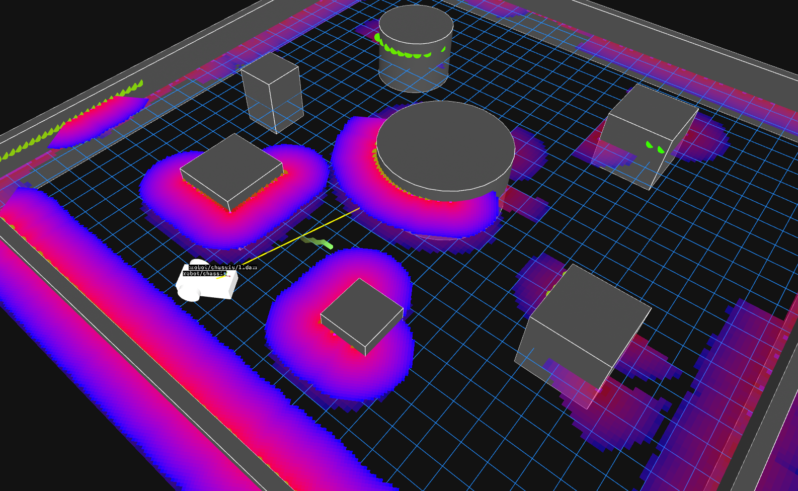

# wato_asd_navigation

Autonomous navigation for a differential-drive robot in ROS 2 and C++. Give it a point to drive to
and it builds its own picture of the world, plans a route around what it finds, and drives there.

Built step by step, documented in [`docs/`](docs/).

### ▶ [Watch the demo](docs/assets/demo.mp4)

<p align="center">
  <a href="docs/assets/demo.mp4">
    
  </a>
</p>

## The system

A four-node ROS 2 navigation pipeline, written from scratch. Each node takes what the one before it
produced and turns it into something closer to a wheel command.

<div align="center">
<pre>
                                       you, in Foxglove
                                              │
                                         /goal_point
                                              │
                                              ▼
 ┌─────────┐ /costmap ┌────────────┐ /map ┌─────────┐ /path ┌─────────┐
 │ costmap │─────────►│ map memory │─────►│ planner │──────►│ control │
 └─────────┘          └────────────┘      └─────────┘       └─────────┘
      ▲                                                          │
      │ /lidar, /odom/filtered                                   │ /cmd_vel
      │                                                          ▼
      │              ┌───────────────────────────────────────────────┐
      └──────────────┤              Gazebo — the robot               │
                     └───────────────────────────────────────────────┘
</pre>
</div>

A closed loop: the wheel speeds move the robot, which changes what the LiDAR sees, which changes
the route. `/odom/filtered` feeds map memory, planner and control as well as the costmap.

- **Costmap** — LiDAR → occupancy grid. What's around the robot right now. [docs/04](docs/04-costmap-node.md)
- **Map memory** — fuse costmaps into a global map. What's been seen so far. [docs/05](docs/05-map-memory-node.md)
- **Planner** — A* from the robot to a goal, over the map. [docs/06](docs/06-planner-node.md)
- **Control** — Pure Pursuit, turning that route into wheel speeds. [docs/07](docs/07-control-node.md)

## Running it

Needs Docker. Full setup in [docs/00](docs/00-setup.md).

```bash
./watod build
./watod up
```

`up` holds the terminal. Open [Foxglove](https://app.foxglove.dev/) and connect to
`ws://localhost:20000`.

Import [`config/wato_asd_training_foxglove_config.json`](config/wato_asd_training_foxglove_config.json)
(Layouts → Import).

The layout has the 3D panel set up, plus a Teleop panel for driving the robot manually.

## Sending a goal

In a second terminal:

```bash
./watod -t robot    # open a shell inside the running robot container

ros2 topic pub /goal_point geometry_msgs/msg/PointStamped "{header: {frame_id: sim_world}, point: {x: -12.0, y: 2.0}}"
```

Pick goals in open ground — a goal inside a large obstacle will still plan a route.
See [docs/06](docs/06-planner-node.md#limitations).

## Docs

- [00](docs/00-setup.md) — Setup on a fresh machine
- [01](docs/01-configure-watod.md) — Configuring watod
- [02](docs/02-code-a-node.md) — Coding a node
- [03](docs/03-test-the-node.md) — Building and testing it
- [04](docs/04-costmap-node.md) — Costmap node
- [05](docs/05-map-memory-node.md) — Map memory node
- [06](docs/06-planner-node.md) — Planner node
- [07](docs/07-control-node.md) — Control node

## Credit

Scaffolded by [WATonomous](https://www.watonomous.ca/) — their
[starter repo](https://github.com/WATonomous/wato_asd_training) and
[spec](https://wiki.watonomous.ca/admission_assignments/asd_admission_assignment/).
Licensed under Apache 2.0.
